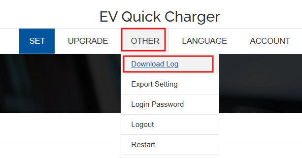
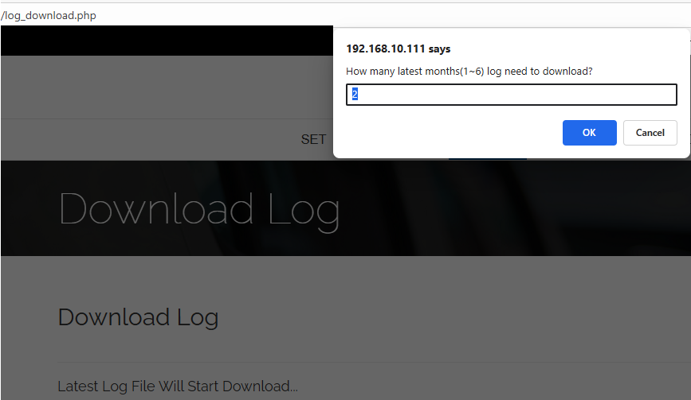

# How to Download Log

To download charger logs:

1. Navigate to **OTHER → Download Log** in the charger menu.  

2. Click the **Download Log** tab item.  
3. After clicking it, a dialog will pop up asking how many calendar months (up to the current month) you would like to download:

   - By default, the value is 2, which corresponds to the last two calendar months.
4. The charger will package the log into a compressed `.zip` file. Then, the download will start.