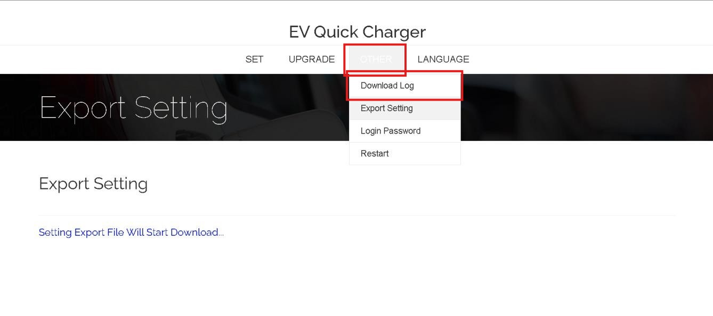

# Download Log

To download charger logs:

1. Navigate to **OTHER → Download Log** in the charger menu.  

2. Click the **Download Log** tab item.  
3. After clicking it, a dialog will pop up ask how many months until now you would like to download:
   - By default is 2 - The recent 2 months
4. The charger will package the log into a compressed `.zip` file. Then, the download will start.