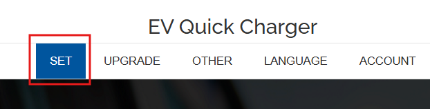
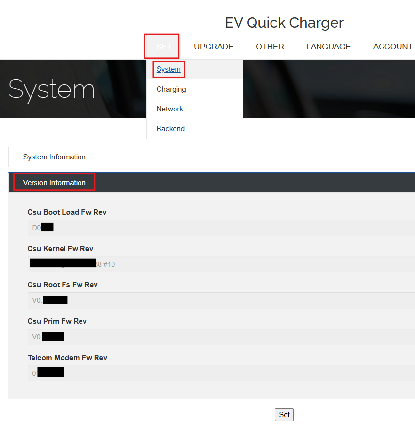

# Version Information

To view charger firmware version information:

1. Navigate to **Set → System** in the charger menu.  

2. Click the **System** tab item.  
3. Click the **Version Information** section to view all the charger firmware version.

