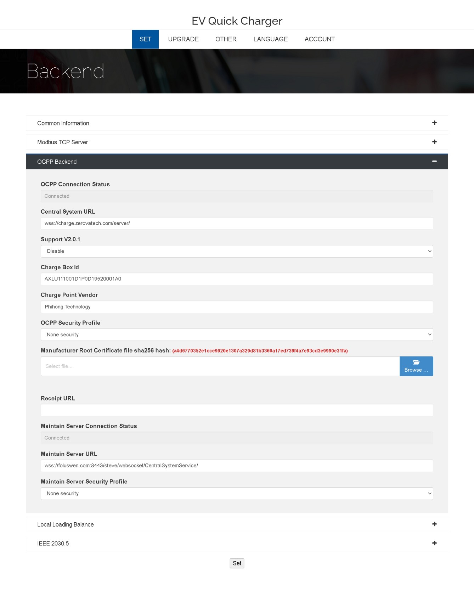

# OCPP Backend

| Field Name                  | Description                                                                                                                   | Attributes |     |
|-----------------------------|-------------------------------------------------------------------------------------------------------------------------------|------------|-----|
|                             |                                                                                                                               | **Read**   | **Write** |
| **Ocpp Connection**         |                                                                                                                               |            |     |
| Status                      | The connection status of OCPP backend                                                                                         | V          |     |
| Central System URL          | The OCPP server URL (including port) to which the charger connects. - `ws://` non-secure OCPP 1.6-J - `wss://` secure OCPP 1.6-J Example: `ws://ocpp.phihong.com.tw:80/` `wss://ocpp.phihong.com.tw:443/` | V          | V   |
| Charge BoxId                | The Charge Box ID used to connect to the OCPP server                                                                          | V          | V   |
| Charge Point Vendor         | Charger vendor name                                                                                                           | V          | V   |
| Ocpp Security Profile       | OCPP security options: - None security - Unsecured Transport with Basic Authentication - TLS with Basic Authentication - TLS with Client Side Certificates | V | V |
| Ocpp Security Password      | Displayed when profile is: - Unsecured Transport with Basic Authentication - TLS with Basic Authentication            | V          | V   |
| Receipt URL                 | Receipt QR code URL. If filled, at session end LCM displays QR Code for user to scan and get receipt info                      | V          | V   |
| **Maintain Server**         |                                                                                                                               |            |     |
| Connection Status           | The connection status of maintain backend                                                                                     | V          |     |
| Maintain Server URL         | The maintain server URL (including port) to which the charger connects. - `ws://` non-secure OCPP 1.6-J - `wss://` secure OCPP 1.6-J Example: `ws://ocpp.phihong.com.tw:80/` `wss://ocpp.phihong.com.tw:443/` | V | V |
| Maintain Server Security Profile | Maintain server security options: - None security - Unsecured Transport with Basic Authentication - TLS with Basic Authentication | V | V |